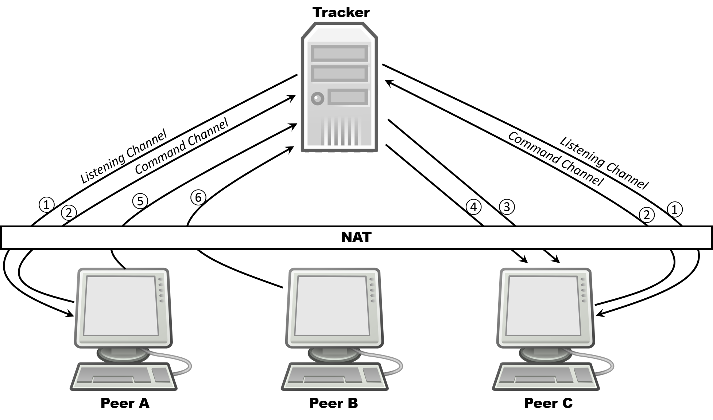

CS3103 Computer Neworks Practice

# P2P File Transfer Project
A P2P network consisting of a centralised directory tracker and several peers. Peers, behind symmetric NAT, are able to inform the tracker on new files available for sharing, as well as download desired chunks of files from other peers. The tracker maintains a database of these chunk entries and pass information to the peers upon request. A TURN server is also incorporated into the tracker.
In this system, only text files are allow for transfer.

Report can be found [here](docs/Report.pdf)

## Initialising the network 
1. Obtain a runnable jar file of the Tracker from [releases](https://github.com/cs3103group3/cs3103/releases)
2. Host it on a server Eg. DigitalOcean
3. Run the command `java -jar <Tracker.jar>` to start the Tracker

## Joining the network
1. Obtain a runnable jar file of the Peer from [releases](https://github.com/cs3103group3/cs3103/releases)
2. Run the command `java -jar <Peer.jar>` to start a Peer program
3. Follow on-screen instructions for uploading/downloading

## Sequence of events

1. Whenever a peer joins the network, it will open a listening socket to listen to any data sent from Tracker
2. A command channel will also be established with Tracker upon joining the network. This channel is used to send commands and requests to Tracker, such as informing Tracker of its available file chunks
3. When a peer wish to download a file, it sends a request through the command channel. Tracker reply with a list of candidate peers for it to choose from via the listening channel. After selection, the peer will establish a temporary connection to Tracker.

For example, Peer C had chosen to download from Peer A, hence it establish a connection with Tracker

4. Since the file size is large, Peer C may choose to download from multiple peers. Hence, for each peer, Peer C will establish a temporary connection to Tracker.
5. With the port information it received through the temporary connection with Peer C, Tracker will ask Peer A establish a temporary connection with it and send data through that channel. Tracker will connect the temporary channels from Peer A and Peer C, acting as a relaying agent while data flow through it.
6. Likewise for Peer B.
7. Upon completion of sending of data, all peers will tear down the temporary channels.